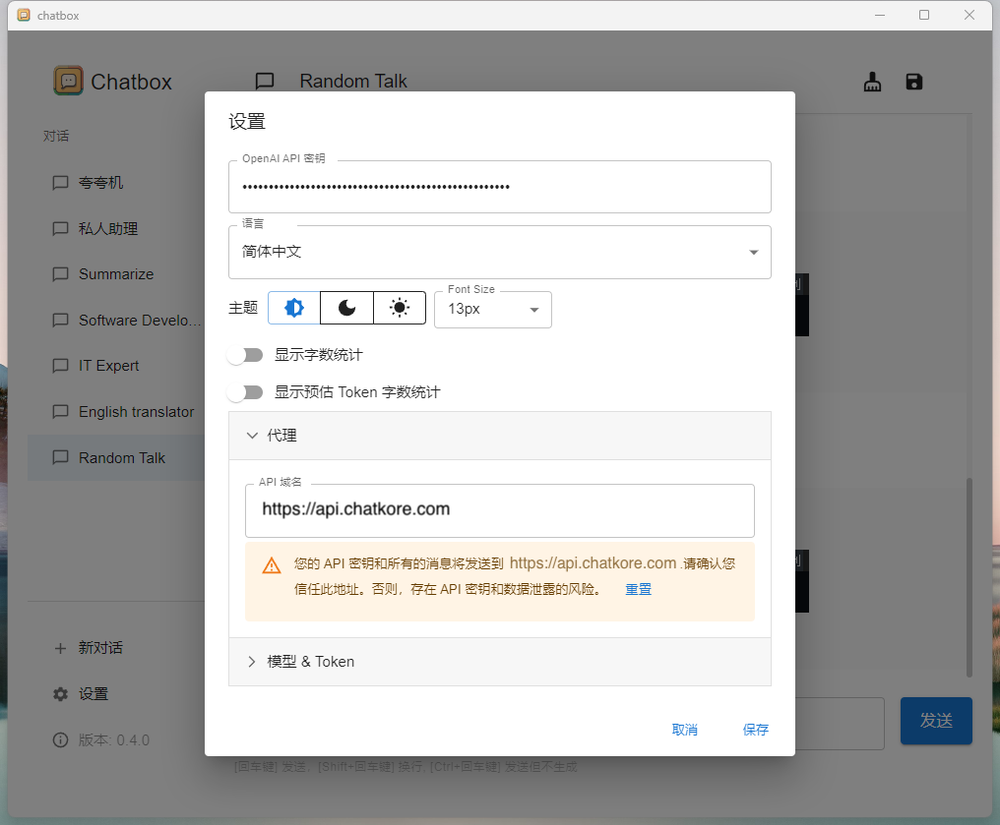
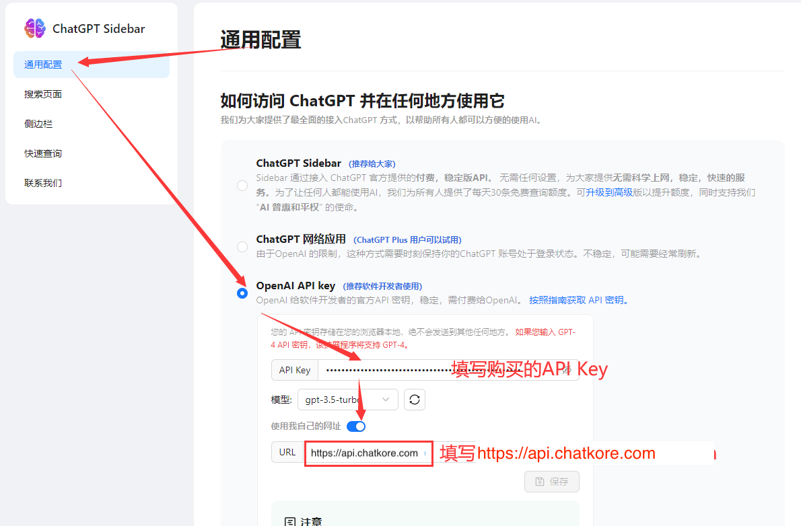
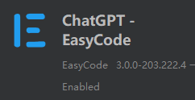
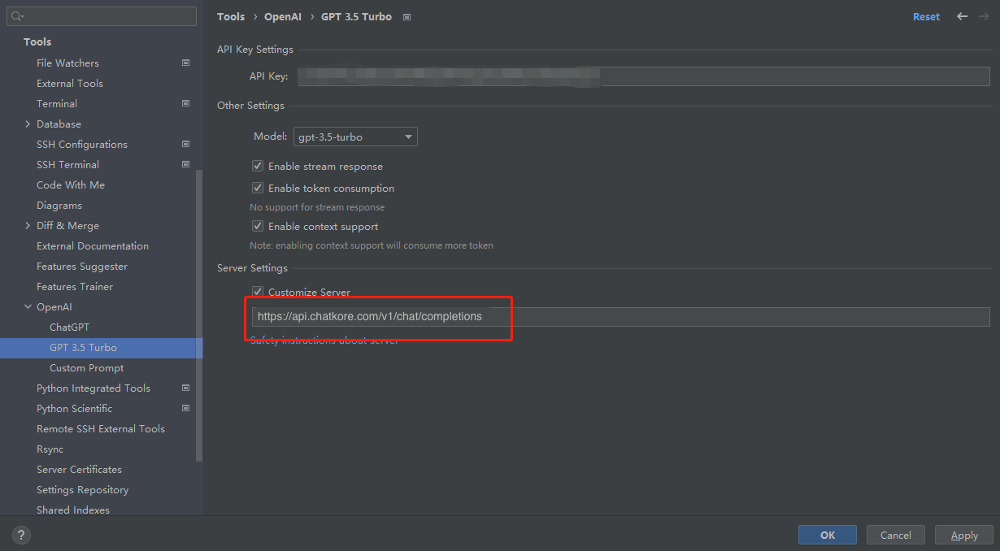
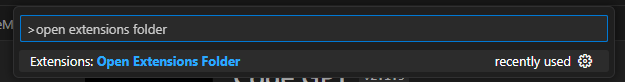
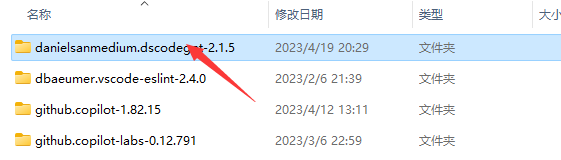
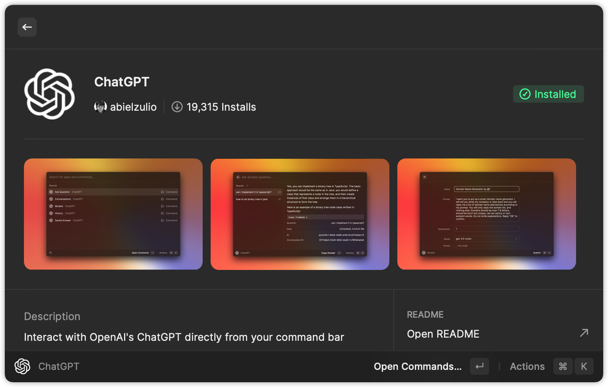
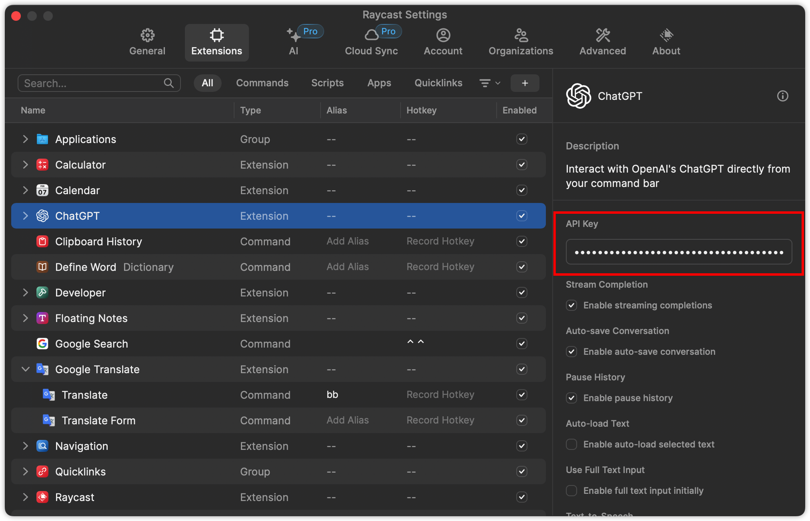
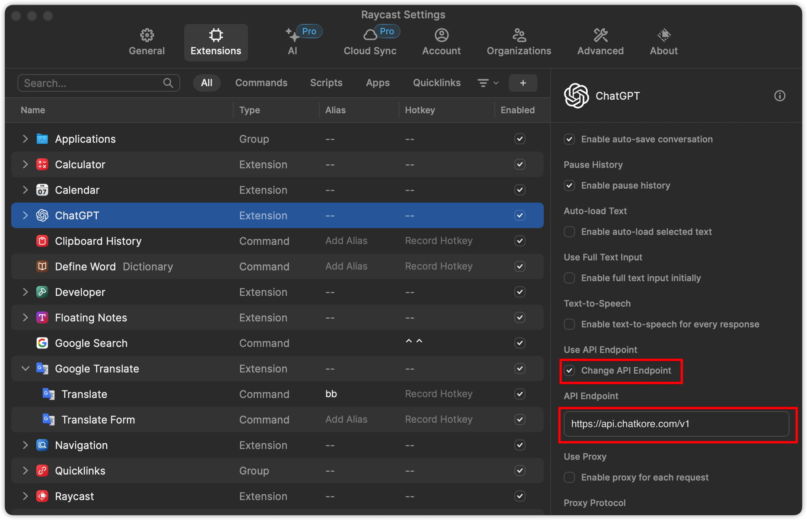

# chatkore
chatkore本意即为开发者提供优质稳定的OpenAI相关的API调用接口，方便国内用户使用各类开源ChatGPT项目或者AI领域的库的使用。有任何问题请加QQ群联系客服：群号[742077418](http://qm.qq.com/cgi-bin/qm/qr?_wv=1027&k=tUZP9cQ-wRDjYNMwZjvs7maNyixcIYB5&authKey=dzF1K7fXUdg%2BMf8zLoPp9L%2F9bvhkoVpyWQoZoEFW0WLeinAmx2OOHBGZfqAjrikl&noverify=0&group_code=742077418)  
官网：[https://www.chatkore.com](https://www.chatkore.com)  
免部署版网页端现已上线：[AI对话机器人-chatkore](https://www.chatkore.com/chat)，现已支持GPT3.5和GPT4的切换，GPT4没有每3小时25条消息的限制。无需翻墙，国内网络即可体验，注册即送100积分。
example中的详细说明请关注：  
知乎号：[chatkore](https://www.zhihu.com/people/2f25274935e6eb5be025ccf0abb1d724 "chatkore知乎号")  
头条号：[chatkore](https://profile.zjurl.cn/rogue/ugc/profile/?version_code=9.4.1&version_name=90401&user_id=4146953757669309&media_id=1665904070450180&request_source=1&active_tab=dongtai&device_id=65&app_name=news_article&share_token=8A0BC5FD-68F6-4982-A223-41BEE00B6BD9&tt_from=mobile_qq&utm_source=mobile_qq&utm_medium=toutiao_ios&utm_campaign=client_share "chatkore头条号")

### 相比OpenAI的主要优势
- 不限制国内使用，可以用支付宝付款，没有封号风险。
- 无需代理即可访问，没有墙的阻拦。
- 支持GPT4，并且没有每3小时25条消息的限制。
- 无需代理即可访问，没有墙的阻拦。
- 无需代理即可访问，没有墙的阻拦。
- 兼容OpenAI接口格式，可以做到平替。支持vscode插件，支持autoGPT，agentGPT。API用法也可参考[官方文档](https://platform.openai.com/docs/api-reference/introduction)
- 无最低消费金额与最低充值金额，可以作为本地测试开发的完美替代品。
- 新增对Embeddings支持，可以用接口运行AutoGPT等应用。

### 变更日志
2023-09-13: 加入常用提示词prompt集合，[常用提示词集合-chatkore](https://www.chatkore.com/prompt/prompt.html)  
2023-08-29: 加入本地知识库示例，目录：examples/ChatDemo/  
2023-08-20: 新版AI对话机器人上线，[新版AI对话机器人-chatkore](https://www.chatkore.com/newchat)  
2023-07-31: 加入数据分析机器人示例，目录：examples/analysisBot/  
2023-07-28: 加入语音聊天机器人示例，目录：examples/voiceChatBot/  
2023-06-15: 支持gpt-4-0613，gpt-3.5-turbo-0613，gpt-3.5-turbo-16k，gpt-3.5-turbo-16k-0613新模型，支持函数调用功能。  

### 使用[chatgpt-web](https://github.com/Chanzhaoyu/chatgpt-web)项目配置
##### 修改service/.env文件
- 设置OPENAI_API_KEY环境变量为chatkore后台获取的Key
- 设置OPENAI_API_BASE_URL环境变量为：https://api.chatkore.com/v1
- 由于网络延迟，建议把TIMEOUT_MS设置为180000或者更高

### 常见软件/插件使用方法

##### **python openai官方库（使用AutoGPT，langchain等）**
示例代码请参考[demo.py](./examples/pythonDemo/demo.py)

***方法一***

```python
import openai
openai.api_base = "https://api.chatkore.com/v1"
```

***方法二（方法一不起作用用这个）***

修改环境变量OPENAI_API_BASE，各个系统怎么改环境变量请自行搜索，修改环境变量后不起作用请重启系统。
```bash
OPENAI_API_BASE=https://api.chatkore.com/v1
```
##### **开源gpt_academic**
找到`config.py`文件中的`API_URL_REDIRECT`配置并修改为以下内容：
```python
API_URL_REDIRECT = {"https://api.openai.com/v1/chat/completions": "https://api.chatkore.com/v1/chat/completions"}
```

##### **ChatBox(推荐使用)**

ChatGPT开源桌面应用，支持全部桌面平台。

下载链接：https://github.com/Bin-Huang/chatbox/releases

使用方法：如图在设置中填入购买的密钥，并将代理设置为`https://api.chatkore.com`即可




##### **浏览器插件ChatGPT Sidebar**

官网链接：https://chatgpt-sidebar.com/

安装好插件后进入设置页面，如图所示修改设置，将url修改为 `https://api.chatkore.com` 。



##### **Jetbrains插件ChatGPT - Easycode**


安装好插件后在Settings > Tools > OpenAI > GPT 3.5 Turbo中如图所示配置好插件，重点要将Server Settings 修改为 `https://api.chatkore.com/v1/chat/completions` 。并勾选Customize Server。




##### **VSCode插件Code GPT**


这个插件修改Host相对麻烦一些，需要修改源码才可以使用。

1. 安装插件。安装好后按Ctrl+Shift+P，弹出框中输入Open Extensions Floder


2. 点击Extensions: Open Extensions Floder，这将打开插件目录，找到Code GPT的文件夹。


3. 打开后进入打开文件./src/clients/openai_client.js，搜索文件中的api.openai.com，并替换为 `api.chatkore.com`。保存文件。


4. 再次回到vscode，按Ctrl+Shift+P，弹出框中输入CodeGPT: Set API KEY，点击CodeGPT: Set API KEY。然后将购买的Key输入进去即可。


5. 以上步骤完成后，重启VSCode

- 其他VSCode插件类似。

##### **Raycast 插件 ChatGPT（推荐使用）**

1. 在 Raycast Store 中找到 ChatGPT 插件，并按照提示安装：


2. 安装完成后在该插件配置中的 `API Key` 中填入我们的API Key，以及选中 `Change API Endpoint`，并在 `API Endpoint` 中填入 `https://api.chatkore.com/v1`



3. 🍺 enjoy it~

